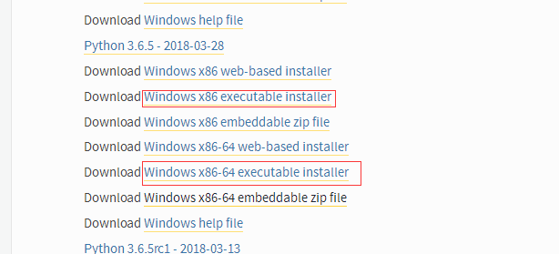
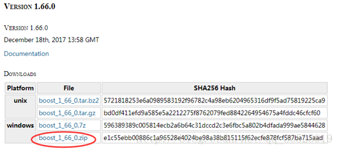
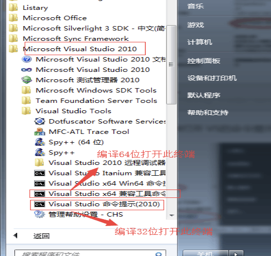
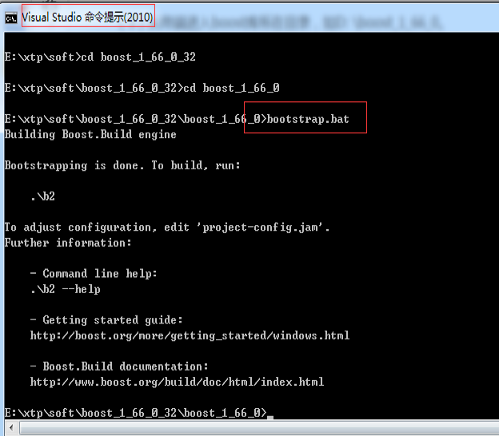
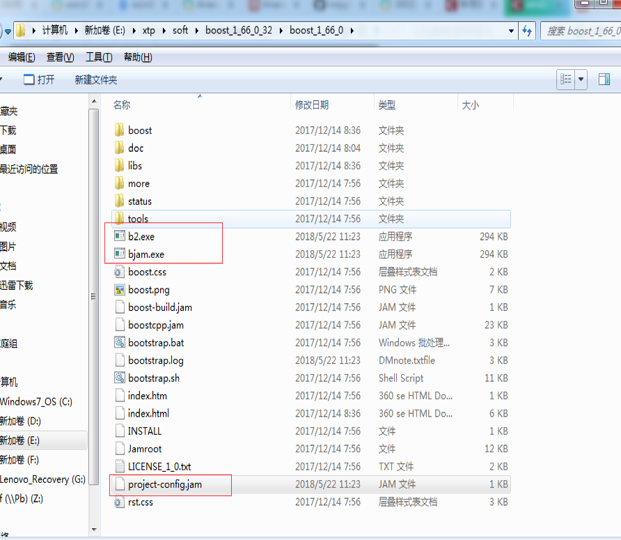

# boost.python库编译说明

近期需要用到C++和python的混合编程，需要在python里面调用C++接口，要用到boost.python库，网上基本都是基于python2的教程，没有python3的。
由于python2和python3的不兼容，因此python3不能直接使用python2的库（已测试，确实会出错），经过多番探索，最终解决boost库在32位和64位的python下的编译问题。

## 1. 环境准备

* windows7 64位
* python3.6.5(32位+64位)
* VS2010 (V100版本)
* boost 1.66.0 或其他版本(还测试了1.57.0)

### 1.1、安装 PYTHON

python3开始使用的是Anaconda3，但是在编译boost时，提示错误，无法完成编译，所以最终选择的是python3.6.5 (32位和64位) 
进入[官网](https://www.python.org/downloads/windows/选择python3.6.5) （可选其他）




### 1.2、下载 BOOST 源码

进入[官网](http://www.boost.org/)，选择最新的版本，这里是1.66.0版本 
下载完成之后，解压 E:\xtp\soft\boost_1_66_0_32\boost_1_66_0



### 1.3、VS2010 下载，安装

## 2、boost的编译

### 2.1、以32位为例，打开32位的编译终端



### 2.2、从终端进入boost库所在目录，

如E:\xtp\soft\boost_1_66_0_32\boost_1_66_0

### 2.3、

运行bootstrap.bat生产32位的bjam.exe，这个bjam将用于后续的编译过程。





### 2.4、进行编译，生成lib文件。

编译时，提示找不到<inttypes.h>此文件，无法打开的错误
这是由于vs2010的版本中没有此文件，所以编译一直报错这里重写了inttypes.h文件，同时将此文件放置到vs的安装目录下，这里用的是vs2010,其对应的安装目录如下：

```
C:\Program Files (x86)\Microsoft Visual Studio 10.0\VC\include
```

### 2.5、
VS2010的版本是V100，下面代码里msvc-10.0中10.0就是我的版本号，根据不同的VS版本的情况进行更改。address-model=32表示生成的库为32位，64就表示64位，具体根据需求情况定，我们编译的是32位，继续在窗口里输入：
```
bjam --toolset=msvc-10.0 --with-python --with-thread --with-date_time --build-type=complete address-model=32
```
（说明：--with-python 里面的python需要是python3版本，要求系统能找到你的python，直接在cmd里面输入python能弹出python3的具体版本信息，如果同时装32位和64位，根据需要配置对应的环境变量）


在boost目录下会生成stage文件夹，里面的lib就是C++所需的python3的lib文件。至此boost.python库编译完成。